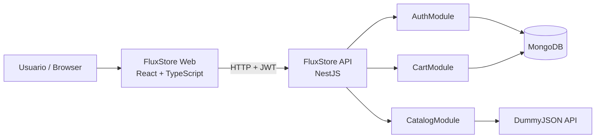
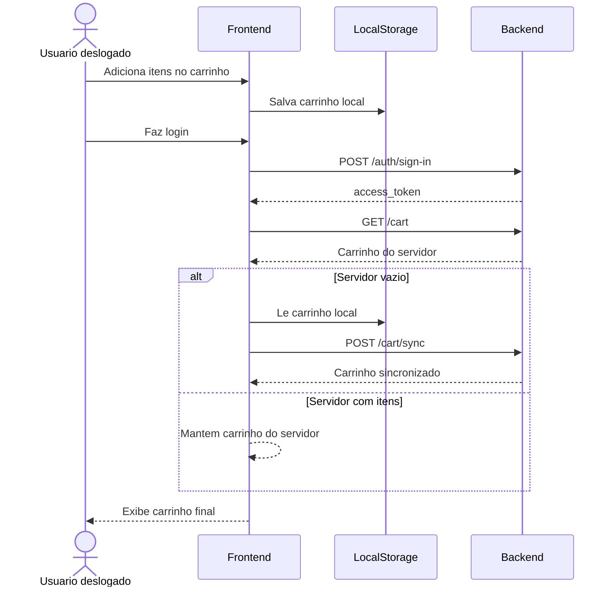
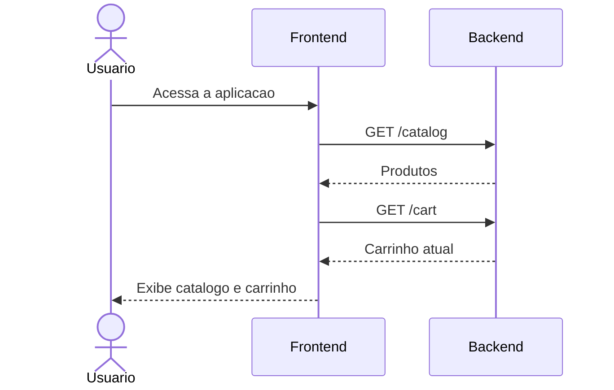
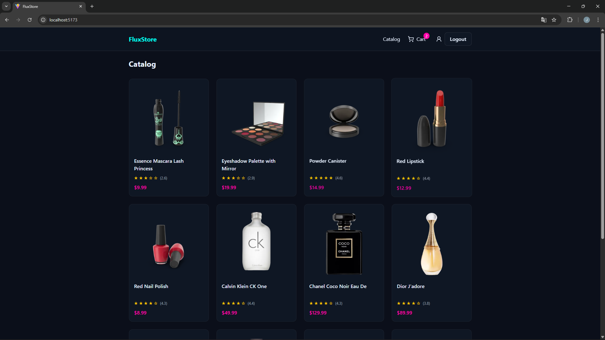
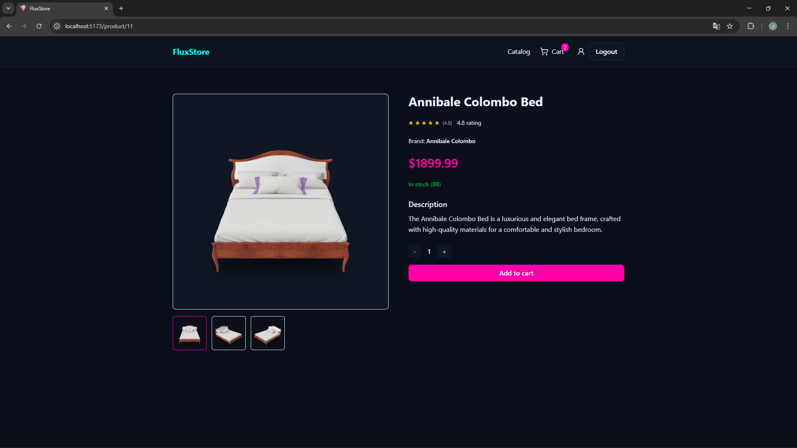
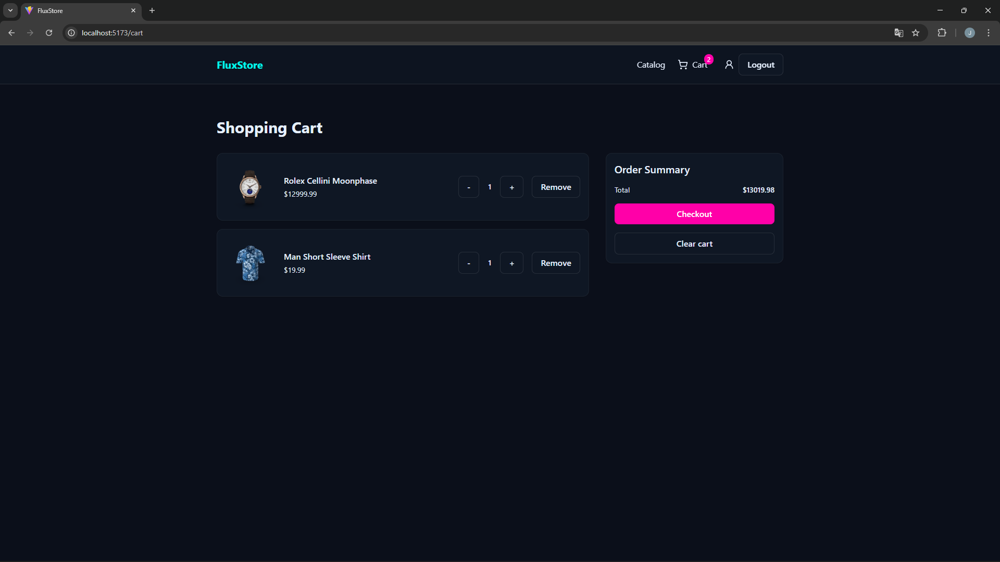
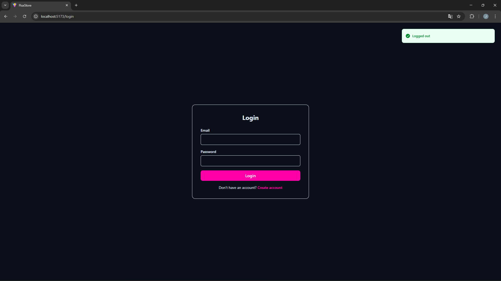
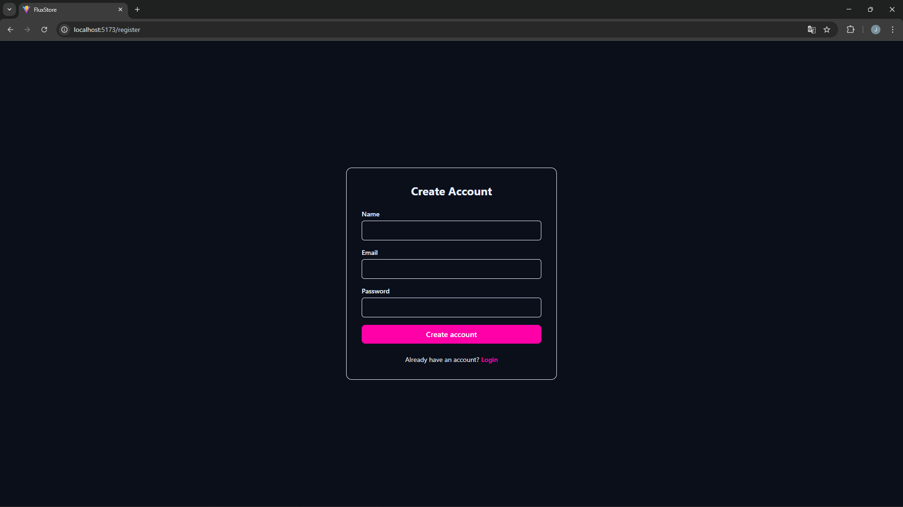

# FluxStore

Documentacao principal de requisitos e visao geral do projeto.

<div style="display: flex; gap: 8px; align-items: center; margin-top: 10px; margin-bottom: 12px; flex-wrap: wrap;">
  
  
  
  
  
  
  
</div>

## Sumario

- [Sobre o projeto](#sobre-o-projeto)
- [Requisitos funcionais](#requisitos-funcionais)
- [Requisitos nao funcionais](#requisitos-nao-funcionais)
- [Tecnologias usadas](#tecnologias-usadas)
- [Documentacao por modulo](#documentacao-por-modulo)
- [Como executar](#como-executar)
- [System design (arquitetura)](#system-design-arquitetura)
- [Diagramas de sequencia](#diagramas-de-sequencia)
- [Prints de tela](#prints-de-tela)
- [Estrutura de pastas (raiz)](#estrutura-de-pastas-raiz)

## Sobre o projeto

FluxStore e uma aplicacao fullstack de catalogo e carrinho de compras.

- Catalogo: consumido de API externa (DummyJSON)
- Carrinho: CRUD local por usuario autenticado (MongoDB)
- Autenticacao: JWT

## Observacoes

- O MongoDB foi escolhido pela flexibilidade do modelo de dados e pela facilidade de usar o **MongoDB Atlas** em producao, mantendo a mesma abordagem adotada no desenvolvimento local.
- A modelagem do carrinho no MongoDB usa **embedding** (itens embutidos no documento de carrinho), simplificando leitura e escrita por usuario.
- A API de produtos (DummyJSON) foi escolhida porque eu ja tinha feito um ecommerce antes e gostei da logica de carrinho, que encaixa bem com uso de **Context API** no frontend.
- A aplicacao foi publicada em uma instancia **EC2** com pipeline automatizado de **build e deploy**.
- URL publica da aplicacao: [http://3.135.230.93/](http://3.135.230.93/)

## Requisitos funcionais

- `RF01`: permitir cadastro de usuario
- `RF02`: permitir login de usuario
- `RF03`: listar produtos paginados do catalogo externo
- `RF04`: exibir detalhe de produto
- `RF05`: permitir adicionar produto ao carrinho
- `RF06`: permitir atualizar quantidade no carrinho
- `RF07`: permitir remover item do carrinho
- `RF08`: permitir limpar carrinho
- `RF09`: persistir carrinho no banco para usuario autenticado
- `RF10`: manter carrinho local para visitante
- `RF11`: sincronizar carrinho local no login quando o carrinho remoto estiver vazio

## Requisitos nao funcionais

- `RNF01`: backend em NestJS
- `RNF02`: frontend em React + TypeScript
- `RNF03`: persistencia em MongoDB
- `RNF04`: validacao de entrada com DTOs e ValidationPipe
- `RNF05`: cobertura de testes unitarios e integracao basica
- `RNF06`: pipeline CI para lint, build e testes
- `RNF07`: Deploy da aplicação de forma automática por meio de pipeline (CI/CD)

## Tecnologias usadas

### Backend

- Node.js
- NestJS
- Mongoose
- MongoDB
- JWT (`@nestjs/jwt`)
- bcrypt
- class-validator / class-transformer
- Jest

### Frontend

- React 19
- TypeScript
- Vite
- React Router
- Axios
- React Hook Form
- Zod
- TanStack Query
- Tailwind CSS
- Vitest + Testing Library

### Infra

- Docker
- Docker Compose
- GitHub Actions (CI e deploy)

## Documentacao por modulo

- Backend: [api/README.md](https://github.com/JoaoVitorAguiar/nestjs-react-ecommerce/tree/main/api)
- Frontend: [web-app/README.md](https://github.com/JoaoVitorAguiar/nestjs-react-ecommerce/tree/main/web-app)

## Como executar

### Opcao 1: Docker Compose

```bash
docker compose up --build
```

- Web: `http://localhost:5173`
- API: `http://localhost:3000`

### Opcao 2: local (manual)

Backend:

```bash
cd api
npm ci
cp .env.sample .env
npm run start:dev
```

Frontend:

```bash
cd web-app
npm ci
cp .env.sample .env
npm run dev
```

## System design (arquitetura)



## Diagramas de sequencia

### Fluxo 1: visitante preenche carrinho e sincroniza ao logar



### Fluxo 2: usuario ja logado entrando no app



## Prints de tela

### Catalogo



### Detalhe do produto



### Carrinho



### Login



### Cadastro



## Estrutura de pastas (raiz)

```text
.
├── api/
├── web-app/
├── docs/
│   └── screenshots/
├── docker-compose.yml
└── README.md
```
